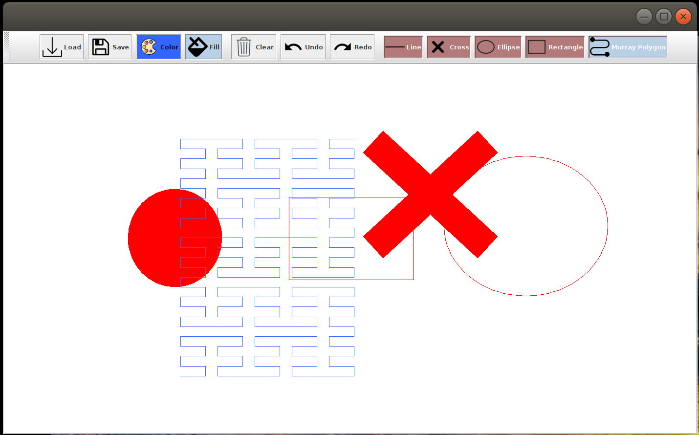

# Simple Vector Drawing Application

University of St. Andrews CS5001 Object Oriented Design, Modeling & Programming Course.
This project features Vector Drawing System using a Java Swing GUI. It uses a Model-View-Controller architectural pattern. 

### Basic Features
-[x] Drawing straight lines.
-[x] Drawing rectangles.
-[x] Drawing ellipses.
-[x] Drawing diagonal crosses.
-[x] Undo/redo.
-[x] Different colours.
-[x] Create JUNIT TEST for Model functionalities.

### Advanced Features
-[x] Support for drawing squares and circles. One way of implementing this feature would be
  using a key (say the Shift key) to lock aspect ratio during the drawing of rectangles and
  ellipses. 
-[x] Load and save vector drawings in a format that permits them to be manipulated as vector
  drawings after loading.
-[x] Add Murray polygons.

### Run Code

~~~
$ cd Vector-Drawing-GUI-Java/src/
$ javac *.java
$ java VectorDrawingMain
~~~

### To run tests (Using St Andrews stacscheck)

~~~
$ cd Vector-Drawing-GUI-Java/
$ stacscheck ./Tests
~~~

